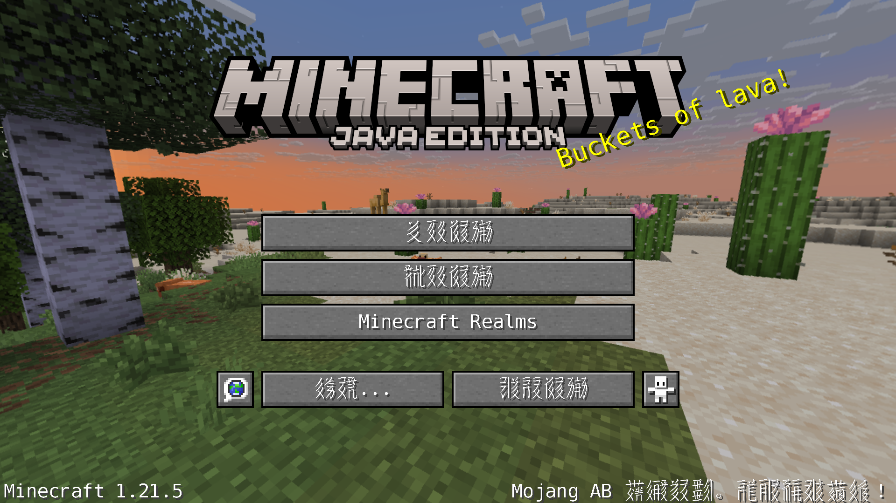
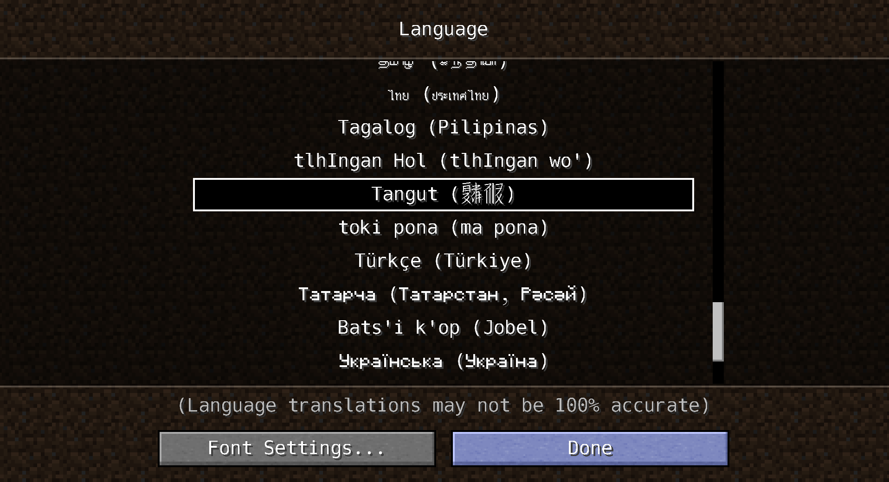
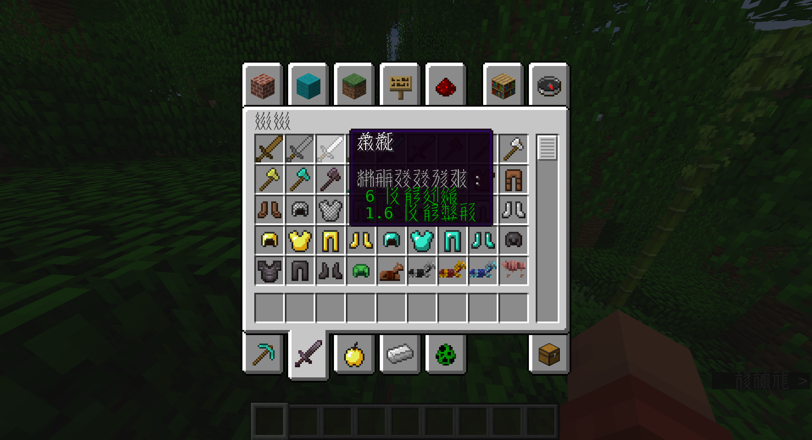

# Minecraft Tangut Language Pack

This project provides a crude Tangut language translation for Minecraft, allowing players to experience the game's interface and in-game text rendered in the historical Tangut script.

## Table of Contents

*   [About This Pack](#about-this-pack)
*   [Features](#features)
*   [Installation](#installation)
*   [Development Process](#development-process)
*   [Acknowledgements & Credits](#acknowledgements--credits)
*   [Contributing](#contributing)
*   [License](#license)

## About This Pack

This language pack is an ambitious endeavor to bring the fascinating Tangut script into the world of Minecraft. It aims to replace the default Chinese localization with its Tangut equivalent, character by character, providing a unique historical and linguistic immersion for players.

## Features

*   **Extensive Character Replacement:** Translates a significant portion of Minecraft's Chinese (Simplified/Traditional) interface and item names into Tangut characters.
*   **Automatic Processing:** Built using Python scripts to automate the character mapping and replacement process.
*   **Continuous Improvement:** Designed to be easily updated as more Tangut character mappings become available or as the game's text changes.

## Installation

1.  **Download:** Obtain the latest `.zip` file of the Tangut Language Pack from the repository.
2.  **Locate Resource Pack Folder:**
    *   Open Minecraft.
    *   Go to "Options" -> "Resource Packs".
    *   Click on "Open Pack Folder".
3.  **Place Pack:** Drag and drop the downloaded `.zip` file into this folder. **Do not unzip it.**
4.  **Activate in Minecraft:**
    *   Return to Minecraft's Resource Packs screen.
    *   The "Minecraft Tangut Language Pack" should now appear on the left side (Available Resource Packs).
    *   Hover over it and click the arrow button to move it to the right side (Selected Resource Packs).
    *   Click "Done" to apply the pack.
5.  **Change Language:**
    *   Go to "Options" -> "Language".
    *   Scroll through the list and select the newly available Tangut language option. (It might appear with its Chinese name or a symbol depending on how Minecraft loads it internally before replacement).
    *   Click "Done". Minecraft will reload its assets.

## Development Process

The creation of this language pack involved a series of automated steps using custom Python scripts to process and transform the raw data.

1.  **Initial Data Acquisition & Cleaning:**
    *   The project started with a raw dataset containing Chinese characters and their corresponding Tangut equivalents, often accompanied by "Not available" messages or additional English meanings.
    *   A Python script (`filter_lines.py` - initially to keep "Not available", then inversed to remove them) was used to filter out irrelevant lines and clean the initial data.
    *   Another script (`remove_letters_and_parentheses.py`) was employed to strip all English alphabet characters and parentheses, ensuring a clean `Chinese_Character:Tangut_Character` format. This produced the core mapping file (e.g., `raw_filtered_na.txt.txt`).

2.  **Mapping File Generation:**
    *   A script (`extract_chinese_tangut_pairs.py`) was then used to specifically extract the Chinese character and its Tangut counterpart from the cleaned, structured data, forming a reliable `Chinese:Tangut` dictionary for subsequent replacement.

3.  **Identifying Unmapped Characters (Debugging & Research):**
    *   A crucial debugging script (`find_unmapped_chinese_characters.py`) was developed. This script compared the Chinese characters present in Minecraft's original JSON language file with the characters available in our Tangut mapping file.
    *   It generated a list of all unique Chinese characters for which no Tangut equivalent was found. This allowed for targeted research and expansion of the Tangut mapping data, ensuring maximum coverage.

4.  **Core Replacement Logic:**
    *   The central part of the process was handled by a dedicated Python script (`replace_chinese_with_tangut.py`). This script performed the following actions:
        *   Loaded the `Chinese:Tangut` mapping (from `raw_filtered_na.txt.txt`).
        *   Loaded Minecraft's original Chinese localization JSON file (e.g., `1.21.X_tangut.json`).
        *   Iterated through every string value within the JSON data.
        *   For each character in a string, it checked if it was a Chinese character present in the Tangut mapping.
        *   If a mapping existed, the Chinese character was replaced with its Tangut equivalent (which could be multiple Tangut characters for a single Chinese one, e.g., 叮 -> 𗙗𗙏).
        *   If a Chinese character had no mapping, it was left as is, and a warning was logged for future reference and mapping expansion.
        *   Finally, the modified JSON data (containing Tangut characters) was saved to a new output file, ready for integration into the language pack.

## Acknowledgements & Credits

This project would not be possible without the invaluable work and dedication of scholars in the field of Tangut studies.

*   **Alan Downes (Tangut.info / Babelstone):** A huge debt of gratitude is owed to Alan Downes for his extensive research, pioneering work on Tangut fonts, and the comprehensive resources available at [Tangut.info](https://tangut.info/) and [babelstone.co.uk](https://babelstone.co.uk/). His meticulous efforts in documenting Tangut characters and providing accessible data were fundamental to the creation of this language pack.

*   **Minecraft Developers:** For creating a game with such robust localization capabilities that allows for projects like this to exist.

## Contributing

This project is open to contributions! If you would like to help improve the Tangut translation or identify missing characters:

1.  Use the `find_unmapped_chinese_characters.py` script to find characters that are currently unmapped.
2.  Research their Tangut equivalents.
3.  Add new entries to your `raw_filtered_na.txt.txt` mapping file following the `Chinese_Character:Tangut_Equivalent` format.
4.  Re-run the `replace_chinese_with_tangut.py` script to generate an updated JSON.

## License

This project is released under the [MIT License](https://opensource.org/licenses/MIT). You are free to use, modify, and distribute this language pack, but please retain the original credits and license information.
